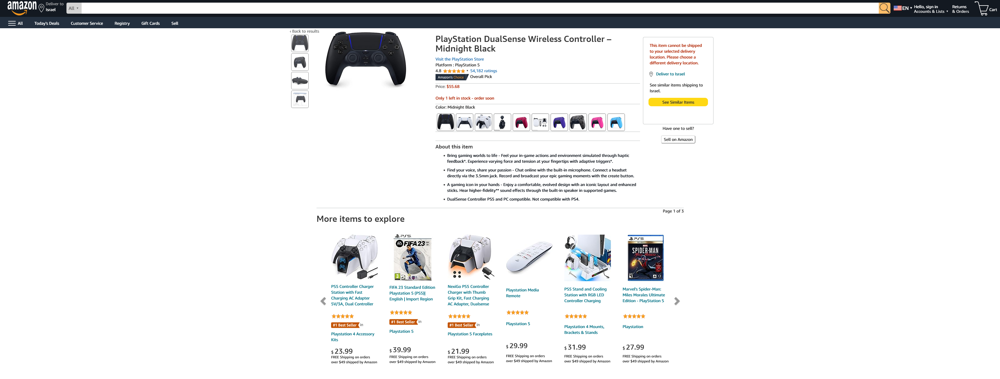

# Task: Copy Amazon Product Page

## Description
Create a webpage that mimics the layout and functionality of an Amazon product page. The goal is to replicate the following elements:

- Navbar for Desktop and Mobile.
- Product title and description.
- Product images with a JavaScript-powered image preview feature.
- A carousel to display related items.

## Requirements

### Product Page Layout
- [ ] Create navbar for both desktop and mobile (500px width).
- [ ] Create a header with the product title.
- [ ] Provide a brief product description.
- [ ] Include images of the product.
- [ ] Implement a section for the product details.

### Image Preview
- [ ] Use JavaScript to allow users to click on thumbnail images to view a larger image.
- [ ] When a user clicks on a thumbnail, display the larger image.

### Related Items Carousel
- [ ] Design a section for displaying related items.
- [ ] Implement a carousel that allows users to scroll through related items.
- [ ] Populate the carousel with at least three related item listings.

## Optional Enhancements
- [ ] Apply CSS styling to match the appearance of an Amazon product page.
- [ ] Add additional interactivity or features to enhance user experience.

## Screenshots 

- [] Original Webpage

- [] My Webpage

